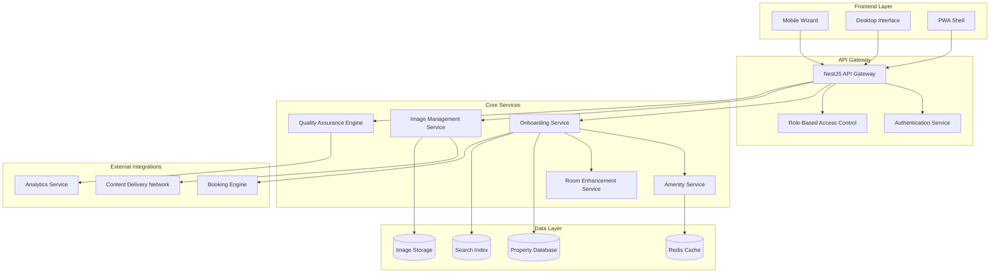

# Design Document: Enhanced Hotel Onboarding System

## Overview

The Enhanced Hotel Onboarding System transforms the existing basic hotel registration into a comprehensive, mobile-first platform that enables hotels to create rich, customer-focused property profiles. The system follows Apple Inc. design principles with clean, intuitive interfaces and implements a modular architecture supporting categorized amenities, advanced image management, detailed property descriptions, and quality assurance.

The design emphasizes progressive enhancement from mobile to desktop, accessibility-first principles, and seamless integration with the existing NestJS/TypeScript backend and Next.js/React frontend. The system processes real, actionable content without dummy data and provides smooth animations and clear visual hierarchy.

## Architecture

### System Architecture



### Mobile-First Progressive Enhancement

The system implements a mobile-first approach with progressive enhancement:

1. **Core Mobile Experience**: Touch-optimized interface with essential functionality
2. **Tablet Enhancement**: Expanded layouts with side-by-side content
3. **Desktop Enhancement**: Full-featured interface with advanced tools
4. **PWA Capabilities**: Offline draft saving and native app-like experience

## Components and Interfaces

### Frontend Components

#### Mobile Wizard Component
```typescript
interface MobileWizardProps {
  currentStep: OnboardingStep;
  totalSteps: number;
  onStepComplete: (stepData: StepData) => Promise<void>;
  onStepBack: () => void;
  draftData: OnboardingDraft;
  isOffline: boolean;
}

interface OnboardingStep {
  id: string;
  title: string;
  description: string;
  component: React.ComponentType;
  validation: ValidationSchema;
  isOptional: boolean;
}
```

#### Amenity Selection Component
```typescript
interface AmenitySelectionProps {
  categories: AmenityCategory[];
  selectedAmenities: string[];
  propertyType: PropertyType;
  onSelectionChange: (amenities: string[]) => void;
  validationRules: AmenityValidationRules;
}

interface AmenityCategory {
  id: string;
  name: string;
  description: string;
  icon: string;
  amenities: Amenity[];
}

interface Amenity {
  id: string;
  name: string;
  description: string;
  icon: string;
  isEcoFriendly: boolean;
  applicablePropertyTypes: PropertyType[];
  businessRules: AmenityRule[];
}
```

#### Image Upload Component
```typescript
interface ImageUploadProps {
  category: ImageCategory;
  maxFiles: number;
  maxFileSize: number;
  qualityStandards: ImageQualityStandards;
  onUploadProgress: (progress: UploadProgress) => void;
  onUploadComplete: (images: ProcessedImage[]) => void;
  onQualityCheck: (results: QualityCheckResult[]) => void;
}

interface ImageQualityStandards {
  minResolution: { width: number; height: number };
  acceptableAspectRatios: number[];
  blurThreshold: number;
  brightnessRange: { min: number; max: number };
  contrastRange: { min: number; max: number };
}
```

### Backend Services

#### Onboarding Service
```typescript
@Injectable()
export class OnboardingService {
  async createOnboardingSession(hotelId: string, userId: string): Promise<OnboardingSession>;
  async updateOnboardingStep(sessionId: string, stepData: StepData): Promise<void>;
  async validateStepData(step: OnboardingStep, data: any): Promise<ValidationResult>;
  async completeOnboarding(sessionId: string): Promise<CompletionResult>;
  async saveDraft(sessionId: string, draftData: OnboardingDraft): Promise<void>;
  async loadDraft(sessionId: string): Promise<OnboardingDraft>;
}

interface OnboardingSession {
  id: string;
  hotelId: string;
  userId: string;
  currentStep: number;
  completedSteps: string[];
  draftData: OnboardingDraft;
  qualityScore: number;
  createdAt: Date;
  updatedAt: Date;
}
```

#### Image Management Service
```typescript
@Injectable()
export class ImageManagementService {
  async uploadImage(file: Express.Multer.File, category: ImageCategory): Promise<ProcessedImage>;
  async validateImageQuality(image: Buffer): Promise<QualityCheckResult>;
  async optimizeImage(image: Buffer): Promise<OptimizedImageSet>;
  async categorizeImage(imageId: string, category: ImageCategory): Promise<void>;
  async generateThumbnails(imageId: string): Promise<ThumbnailSet>;
  async deleteImage(imageId: string): Promise<void>;
}

interface ProcessedImage {
  id: string;
  originalUrl: string;
  optimizedUrls: { [size: string]: string };
  thumbnails: ThumbnailSet;
  metadata: ImageMetadata;
  qualityScore: number;
  category: ImageCategory;
}
```

#### Quality Assurance Engine
```typescript
@Injectable()
export class QualityAssuranceEngine {
  async calculateQualityScore(onboardingData: OnboardingData): Promise<QualityScore>;
  async identifyMissingInformation(onboardingData: OnboardingData): Promise<MissingInfoAlert[]>;
  async validateImageQuality(images: ProcessedImage[]): Promise<ImageQualityReport>;
  async generateRecommendations(qualityScore: QualityScore): Promise<Recommendation[]>;
  async createQualityReport(sessionId: string): Promise<QualityReport>;
}

interface QualityScore {
  overall: number;
  imageQuality: number;
  contentCompleteness: number;
  policyClarity: number;
  breakdown: ScoreBreakdown;
}

interface ScoreBreakdown {
  imageQuality: {
    score: number;
    weight: 0.4;
    factors: ImageQualityFactors;
  };
  contentCompleteness: {
    score: number;
    weight: 0.4;
    factors: ContentCompletenessFactors;
  };
  policyClarity: {
    score: number;
    weight: 0.2;
    factors: PolicyClarityFactors;
  };
}
```

#### Amenity Service
```typescript
@Injectable()
export class AmenityService {
  async getAmenitiesByCategory(): Promise<CategorizedAmenities>;
  async validateAmenitySelection(amenities: string[], propertyType: PropertyType): Promise<ValidationResult>;
  async getBusinessRules(propertyType: PropertyType, region: string): Promise<AmenityValidationRules>;
  async updateAmenityRules(rules: AmenityValidationRules): Promise<void>;
}

interface CategorizedAmenities {
  propertyWide: Amenity[];
  roomSpecific: Amenity[];
  business: Amenity[];
  wellness: Amenity[];
  dining: Amenity[];
  sustainability: Amenity[];
}
```

## Data Models

### Enhanced Hotel Entity
```typescript
interface EnhancedHotel {
  id: string;
  basicInfo: HotelBasicInfo;
  propertyDescription: RichTextContent;
  locationDetails: LocationDetails;
  policies: HotelPolicies;
  amenities: CategorizedAmenities;
  images: CategorizedImages;
  businessFeatures: BusinessFeatures;
  qualityMetrics: QualityMetrics;
  onboardingStatus: OnboardingStatus;
  createdAt: Date;
  updatedAt: Date;
}

interface HotelBasicInfo {
  name: string;
  propertyType: PropertyType;
  starRating: number;
  contactInfo: ContactInfo;
  address: Address;
}

interface RichTextContent {
  content: string;
  format: 'markdown' | 'html';
  wordCount: number;
  readingTime: number;
}

interface LocationDetails {
  nearbyAttractions: Attraction[];
  transportation: TransportationOptions;
  accessibility: AccessibilityFeatures;
  neighborhood: NeighborhoodInfo;
}

interface HotelPolicies {
  checkIn: CheckInPolicy;
  checkOut: CheckOutPolicy;
  cancellation: CancellationPolicy;
  booking: BookingPolicy;
  pet: PetPolicy;
  smoking: SmokingPolicy;
}
```

### Enhanced Room Entity
```typescript
interface EnhancedRoom {
  id: string;
  hotelId: string;
  basicInfo: RoomBasicInfo;
  description: RichTextContent;
  amenities: RoomAmenities;
  images: CategorizedImages;
  layout: RoomLayout;
  pricing: RoomPricing;
  availability: RoomAvailability;
  qualityMetrics: QualityMetrics;
}

interface RoomBasicInfo {
  name: string;
  type: RoomType;
  capacity: RoomCapacity;
  size: RoomSize;
  bedConfiguration: BedConfiguration;
}

interface RoomAmenities {
  inherited: string[]; // From property-wide amenities
  specific: string[]; // Room-specific amenities
  overrides: AmenityOverride[]; // Room-level overrides of property amenities
}

interface RoomLayout {
  floorPlan: string; // URL to floor plan image
  dimensions: RoomDimensions;
  features: LayoutFeature[];
  virtualTour: VirtualTourData;
}
```

### Image Management Models
```typescript
interface CategorizedImages {
  exterior: ProcessedImage[];
  lobby: ProcessedImage[];
  rooms: ProcessedImage[];
  amenities: ProcessedImage[];
  dining: ProcessedImage[];
  recreational: ProcessedImage[];
  business: ProcessedImage[];
  virtualTours: VirtualTourData[];
}

interface ImageMetadata {
  filename: string;
  size: number;
  dimensions: { width: number; height: number };
  format: string;
  uploadedAt: Date;
  uploadedBy: string;
  qualityChecks: QualityCheckResult;
  tags: string[];
}

interface QualityCheckResult {
  passed: boolean;
  score: number;
  issues: QualityIssue[];
  recommendations: string[];
}

interface QualityIssue {
  type: 'resolution' | 'blur' | 'brightness' | 'contrast' | 'aspect_ratio';
  severity: 'low' | 'medium' | 'high';
  description: string;
  suggestedFix: string;
}
```

### Business Features Models
```typescript
interface BusinessFeatures {
  meetingRooms: MeetingRoom[];
  businessCenter: BusinessCenter;
  connectivity: ConnectivityDetails;
  workSpaces: WorkSpace[];
  services: BusinessService[];
}

interface MeetingRoom {
  id: string;
  name: string;
  capacity: number;
  equipment: Equipment[];
  bookingProcedure: string;
  hourlyRate: number;
  images: ProcessedImage[];
}

interface ConnectivityDetails {
  wifiSpeed: WifiSpeed;
  coverage: CoverageArea[];
  reliability: ReliabilityMetrics;
  businessGrade: boolean;
}

interface WorkSpace {
  id: string;
  name: string;
  type: 'quiet_zone' | 'co_working' | 'business_lounge';
  capacity: number;
  hours: OperatingHours;
  amenities: string[];
  isAccessible24x7: boolean;
}
```

Now I need to use the prework tool to analyze the acceptance criteria before writing the Correctness Properties section.

<function_calls>
<invoke name="prework">
<parameter name="featureName">enhanced-hotel-onboarding

## Correctness Properties

*A property is a characteristic or behavior that should hold true across all valid executions of a system—essentially, a formal statement about what the system should do. Properties serve as the bridge between human-readable specifications and machine-verifiable correctness guarantees.*

### Property 1: Amenity Categorization and Display
*For any* set of amenities with category assignments, the display function should group amenities by their assigned categories and include both visual icons and descriptive text for each amenity, with eco-friendly indicators displayed for amenities marked as sustainable.
**Validates: Requirements 1.1, 1.2, 1.3**

### Property 2: Amenity Validation and Storage
*For any* amenity selection and property configuration, the validation system should enforce business rules based on property type and region, and successful selections should be stored with proper categorization and metadata preservation.
**Validates: Requirements 1.4, 1.5**

### Property 3: Image Processing and Optimization
*For any* uploaded image, the system should categorize it by type, generate multiple optimized variants for different device types, and maintain all resolution variants with proper metadata associations.
**Validates: Requirements 2.1, 2.2, 2.6**

### Property 4: Image Quality Validation
*For any* image submitted for quality checking, the validation system should enforce measurable standards (resolution, aspect ratio, blur, brightness, contrast) and provide specific feedback with actionable recommendations when standards are not met.
**Validates: Requirements 2.3, 2.4**

### Property 5: Virtual Tour Integration
*For any* virtual tour data, the system should properly handle and display 360-degree content with appropriate integration into the image management system.
**Validates: Requirements 2.5**

### Property 6: Rich Text and Data Completeness
*For any* property information input, the system should support rich text formatting, capture all required data components (location details, policies, room layouts, business features), and validate completeness against quality standards.
**Validates: Requirements 3.1, 3.2, 3.3, 3.4, 4.4, 5.1, 5.2, 5.4**

### Property 7: Customer-Friendly Presentation
*For any* property or business feature data, the display functions should format information in scannable, customer-friendly formats appropriate for booking decisions.
**Validates: Requirements 3.5, 5.5**

### Property 8: Room Enhancement and Amenity Inheritance
*For any* room configuration, the system should support detailed descriptions, distinguish room-specific amenities from property-wide features, support multiple categorized images per room, and properly implement amenity inheritance with room-level overrides.
**Validates: Requirements 4.1, 4.2, 4.3, 4.6**

### Property 9: Room Content Validation
*For any* room setup, the validation system should ensure sufficient visual and descriptive content is present before allowing completion.
**Validates: Requirements 4.5**

### Property 10: Workspace Categorization
*For any* workspace definition, the system should properly categorize work areas (quiet zones, co-working, business lounge) and accurately record accessibility and operating hours.
**Validates: Requirements 5.3**

### Property 11: Mobile Interface Functionality
*For any* mobile device access, the system should display a progressive multi-step interface optimized for touch interaction, provide clear progress indicators, and integrate with device camera for photo uploads with real-time feedback.
**Validates: Requirements 6.1, 6.2, 6.3**

### Property 12: Offline Functionality and Data Persistence
*For any* connectivity interruption, the system should save draft progress locally and sync when connection is restored, while allowing navigation between steps without data loss.
**Validates: Requirements 6.4, 6.6**

### Property 13: Real-Time Validation
*For any* user input, the validation system should provide immediate feedback without requiring form submission.
**Validates: Requirements 6.5**

### Property 14: Quality Score Calculation
*For any* onboarding data, the quality assurance engine should calculate completion scores using the specified weighted factors (image quality 40%, content completeness 40%, policy clarity 20%) and produce consistent, reproducible results.
**Validates: Requirements 7.1**

### Property 15: Missing Information Detection and Recommendations
*For any* incomplete onboarding data, the quality assurance engine should identify specific missing information, provide targeted alerts, flag substandard images, suggest improvements based on industry best practices, and generate comprehensive quality reports.
**Validates: Requirements 7.2, 7.3, 7.4, 7.5**

### Property 16: Data Persistence and Integration
*For any* onboarding data (amenities, images, property information), the system should store data with proper relational mapping, maintain metadata and category associations, preserve data consistency across all related components, and trigger appropriate system updates upon completion.
**Validates: Requirements 8.1, 8.2, 8.3, 8.4**

### Property 17: Data Migration Preservation
*For any* existing hotel data, migration processes should preserve all original information while successfully adding new structured enhancements.
**Validates: Requirements 8.5**

### Property 18: Upload Performance and UI Responsiveness
*For any* large image upload (up to 5MB), the system should handle the upload without blocking the user interface and maintain responsiveness.
**Validates: Requirements 9.2**

### Property 19: Quality Report Performance
*For any* property complexity level, quality report generation should complete within 5 seconds.
**Validates: Requirements 9.4**

### Property 20: Mobile Data Optimization
*For any* mobile interface request, the system should optimize data transfer to minimize bandwidth usage while maintaining full functionality.
**Validates: Requirements 9.5**

### Property 21: Role-Based Access Control
*For any* user with assigned roles, the system should enforce appropriate permissions and restrict access based on role-based rules.
**Validates: Requirements 10.1**

### Property 22: Security and Compliance
*For any* stored data, the system should implement appropriate access controls, comply with data protection regulations, maintain comprehensive audit logs for all changes, and encrypt sensitive information in transit and at rest.
**Validates: Requirements 10.2, 10.3, 10.4, 10.5**

### Property 23: Idempotent Step Updates
*For any* onboarding step update submitted multiple times with identical data, the system should produce the same persisted state without duplication or side effects.
**Validates: Requirements 6.4, 8.3** (supports offline sync and data consistency)

## Error Handling

### Image Upload Error Handling
- **File Size Exceeded**: Provide clear feedback with compression suggestions
- **Quality Check Failures**: Return specific improvement recommendations with visual examples
- **Upload Interruption**: Implement retry mechanisms with progress preservation
- **Unsupported Formats**: Guide users to supported formats with conversion suggestions

### Validation Error Handling
- **Business Rule Violations**: Explain rule constraints with alternative suggestions
- **Incomplete Data**: Highlight missing fields with completion guidance
- **Real-Time Validation**: Provide immediate, non-blocking feedback
- **Network Connectivity**: Queue validations for retry when connection is restored

### Mobile-Specific Error Handling
- **Camera Access Denied**: Provide alternative upload methods
- **Storage Limitations**: Implement progressive cleanup of temporary files
- **Offline Mode**: Clear indication of offline status with sync pending notifications
- **Touch Interface Errors**: Implement gesture recovery and undo functionality

### Quality Assurance Error Handling
- **Score Calculation Failures**: Fallback to basic completeness metrics
- **Recommendation Engine Errors**: Provide generic best practice suggestions
- **Report Generation Timeouts**: Offer simplified reports with full report retry option

## Testing Strategy

The Enhanced Hotel Onboarding System requires a comprehensive dual testing approach combining unit tests for specific scenarios and property-based tests for universal correctness validation.

### Property-Based Testing Configuration

**Testing Library**: Fast-check for TypeScript/JavaScript property-based testing
**Minimum Iterations**: 100 iterations per property test to ensure comprehensive input coverage
**Test Organization**: Each correctness property implemented as a single property-based test

### Property Test Implementation

Each property test must:
- Reference its corresponding design document property number
- Use the tag format: **Feature: enhanced-hotel-onboarding, Property {number}: {property_text}**
- Generate diverse, realistic test data representing actual hotel onboarding scenarios
- Validate universal properties across all generated inputs

### Unit Testing Focus Areas

**Specific Examples and Edge Cases**:
- Empty amenity selections with various property types
- Image uploads at exact size limits (5MB boundary testing)
- Malformed rich text content handling
- Boundary conditions for quality score calculations (0%, 50%, 100% completeness)

**Integration Points**:
- API gateway authentication and authorization flows
- Database transaction handling for complex onboarding data
- External service integration (CDN, analytics, booking engine)
- Mobile PWA offline/online state transitions

**Error Conditions**:
- Network failures during multi-step onboarding processes
- Concurrent user modifications to the same property
- Invalid file formats and corrupted image uploads
- Business rule configuration changes during active onboarding sessions

### Testing Data Generation

**Property-Based Test Generators**:
- Hotel property types with realistic amenity combinations
- Image files with varying quality parameters (resolution, blur, brightness)
- Rich text content with different formatting complexity levels
- User roles and permission combinations
- Mobile device capabilities and network conditions

**Realistic Test Scenarios**:
- Multi-room properties with complex amenity inheritance patterns
- Business hotels with extensive meeting room configurations
- Boutique properties with unique selling propositions
- Chain properties with standardized amenity sets

### Performance Testing Integration

**Property-Based Performance Tests**:
- Quality report generation time across varying property complexity
- Image optimization processing time for different file sizes
- Mobile interface responsiveness under various network conditions
- Concurrent user load testing with realistic onboarding patterns

### Accessibility and Mobile Testing

**Property-Based Accessibility Tests**:
- Touch interface usability across different screen sizes
- Keyboard navigation completeness for all onboarding flows
- Screen reader compatibility for all form elements and feedback messages
- Color contrast and visual hierarchy validation

The testing strategy ensures that both specific edge cases are covered through targeted unit tests while universal correctness properties are validated through comprehensive property-based testing, providing confidence in the system's reliability across all possible usage scenarios.