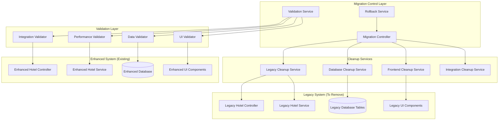

# Design Document: Hotel Onboarding Migration

## Overview

The Hotel Onboarding Migration system completes the transition from legacy basic hotel onboarding to the fully implemented enhanced hotel onboarding system. Since the enhanced system is already operational, this migration focuses on cleanup, removal of legacy components, and ensuring all systems integrate exclusively with enhanced components.

The design implements a systematic cleanup approach that safely removes legacy code, updates database references, cleans up frontend components, and validates system integrity throughout the process. The migration ensures zero downtime and maintains data consistency while eliminating confusion from mixed old/new interfaces.

## Architecture

### Migration Architecture



### Migration Phases

The migration follows a structured approach with validation at each phase:

1. **Assessment Phase**: Identify all legacy components and dependencies
2. **Backend Cleanup Phase**: Remove legacy controllers, services, and database components
3. **Frontend Cleanup Phase**: Remove legacy UI components and update routes
4. **Integration Update Phase**: Update all system integrations to use enhanced data
5. **Validation Phase**: Comprehensive testing and validation
6. **Monitoring Update Phase**: Update monitoring and alerting systems

## Components and Interfaces

### Migration Controller
```typescript
@Controller('migration/hotel-onboarding')
export class HotelOnboardingMigrationController {
  async startMigration(): Promise<MigrationResult>;
  async getMigrationStatus(): Promise<MigrationStatus>;
  async validateMigration(): Promise<ValidationResult>;
  async rollbackMigration(phase: MigrationPhase): Promise<RollbackResult>;
}

interface MigrationResult {
  success: boolean;
  phase: MigrationPhase;
  completedSteps: string[];
  errors: MigrationError[];
  warnings: string[];
  nextPhase?: MigrationPhase;
}

interface MigrationStatus {
  currentPhase: MigrationPhase;
  overallProgress: number;
  phaseProgress: number;
  startedAt: Date;
  estimatedCompletion: Date;
  errors: MigrationError[];
  warnings: string[];
}
```

### Legacy Cleanup Service
```typescript
@Injectable()
export class LegacyCleanupService {
  async identifyLegacyComponents(): Promise<LegacyComponent[]>;
  async removeLegacyControllers(): Promise<CleanupResult>;
  async removeLegacyServices(): Promise<CleanupResult>;
  async removeLegacyEntities(): Promise<CleanupResult>;
  async removeLegacyDTOs(): Promise<CleanupResult>;
  async updateImportStatements(): Promise<CleanupResult>;
  async validateCleanup(): Promise<ValidationResult>;
}

interface LegacyComponent {
  type: 'controller' | 'service' | 'entity' | 'dto' | 'test';
  filePath: string;
  dependencies: string[];
  referencedBy: string[];
  canSafelyRemove: boolean;
  removalRisk: 'low' | 'medium' | 'high';
}

interface CleanupResult {
  success: boolean;
  removedFiles: string[];
  updatedFiles: string[];
  errors: CleanupError[];
  warnings: string[];
}
```

### Database Cleanup Service
```typescript
@Injectable()
export class DatabaseCleanupService {
  async validateEnhancedDataExists(): Promise<ValidationResult>;
  async updateBookingReferences(): Promise<UpdateResult>;
  async dropLegacyTables(): Promise<DropResult>;
  async updateForeignKeyConstraints(): Promise<UpdateResult>;
  async validateDataIntegrity(): Promise<ValidationResult>;
  async createBackup(): Promise<BackupResult>;
}

interface UpdateResult {
  success: boolean;
  recordsUpdated: number;
  tablesAffected: string[];
  errors: DatabaseError[];
  rollbackScript?: string;
}

interface DropResult {
  success: boolean;
  droppedTables: string[];
  droppedIndexes: string[];
  droppedConstraints: string[];
  backupCreated: boolean;
  rollbackScript: string;
}
```

### Frontend Cleanup Service
```typescript
@Injectable()
export class FrontendCleanupService {
  async identifyLegacyComponents(): Promise<LegacyUIComponent[]>;
  async removeLegacyPages(): Promise<CleanupResult>;
  async removeLegacyComponents(): Promise<CleanupResult>;
  async updateRoutes(): Promise<RouteUpdateResult>;
  async updateNavigation(): Promise<NavigationUpdateResult>;
  async validateUIIntegrity(): Promise<UIValidationResult>;
}

interface LegacyUIComponent {
  type: 'page' | 'component' | 'hook' | 'service';
  filePath: string;
  usedBy: string[];
  hasEnhancedReplacement: boolean;
  migrationComplexity: 'simple' | 'moderate' | 'complex';
}

interface RouteUpdateResult {
  success: boolean;
  routesUpdated: string[];
  redirectsAdded: string[];
  routesRemoved: string[];
  errors: RouteError[];
}
```

### Integration Cleanup Service
```typescript
@Injectable()
export class IntegrationCleanupService {
  async updateSearchIntegration(): Promise<IntegrationResult>;
  async updateBookingIntegration(): Promise<IntegrationResult>;
  async updateAnalyticsIntegration(): Promise<IntegrationResult>;
  async updatePartnerIntegration(): Promise<IntegrationResult>;
  async validateAllIntegrations(): Promise<IntegrationValidationResult>;
}

interface IntegrationResult {
  success: boolean;
  integrationName: string;
  updatedEndpoints: string[];
  dataStructureChanges: DataStructureChange[];
  performanceImpact: PerformanceImpact;
  rollbackPlan: string;
}

interface DataStructureChange {
  field: string;
  oldType: string;
  newType: string;
  migrationRequired: boolean;
  backwardCompatible: boolean;
}
```

## Data Models

### Migration Tracking Models
```typescript
interface MigrationSession {
  id: string;
  startedAt: Date;
  completedAt?: Date;
  currentPhase: MigrationPhase;
  status: MigrationStatus;
  phases: MigrationPhaseResult[];
  errors: MigrationError[];
  warnings: string[];
  rollbackPlan: RollbackPlan;
}

interface MigrationPhaseResult {
  phase: MigrationPhase;
  startedAt: Date;
  completedAt?: Date;
  success: boolean;
  steps: MigrationStepResult[];
  errors: MigrationError[];
  rollbackScript?: string;
}

interface MigrationStepResult {
  stepName: string;
  success: boolean;
  duration: number;
  details: any;
  errors: MigrationError[];
}

enum MigrationPhase {
  ASSESSMENT = 'assessment',
  BACKEND_CLEANUP = 'backend_cleanup',
  FRONTEND_CLEANUP = 'frontend_cleanup',
  INTEGRATION_UPDATE = 'integration_update',
  VALIDATION = 'validation',
  MONITORING_UPDATE = 'monitoring_update',
  COMPLETED = 'completed'
}
```

### Validation Models
```typescript
interface ValidationResult {
  isValid: boolean;
  score: number;
  checks: ValidationCheck[];
  errors: ValidationError[];
  warnings: string[];
  recommendations: string[];
}

interface ValidationCheck {
  name: string;
  passed: boolean;
  details: string;
  severity: 'low' | 'medium' | 'high' | 'critical';
  category: 'data' | 'integration' | 'ui' | 'performance' | 'security';
}

interface DataIntegrityCheck {
  checkName: string;
  tableName: string;
  recordCount: number;
  orphanedRecords: number;
  invalidReferences: number;
  passed: boolean;
}
```

### Cleanup Tracking Models
```typescript
interface CleanupTracker {
  sessionId: string;
  componentType: 'backend' | 'frontend' | 'database' | 'integration';
  itemsToRemove: CleanupItem[];
  itemsRemoved: CleanupItem[];
  errors: CleanupError[];
  rollbackData: RollbackData[];
}

interface CleanupItem {
  type: string;
  identifier: string;
  filePath?: string;
  dependencies: string[];
  removalOrder: number;
  removed: boolean;
  removedAt?: Date;
}

interface RollbackData {
  itemType: string;
  identifier: string;
  originalContent?: string;
  originalLocation?: string;
  rollbackScript?: string;
  canRollback: boolean;
}
```

Now I need to use the prework tool to analyze the acceptance criteria before writing the Correctness Properties section.

<function_calls>
<invoke name="prework">
<parameter name="featureName">hotel-onboarding-migration

## Correctness Properties

*A property is a characteristic or behavior that should hold true across all valid executions of a system—essentially, a formal statement about what the system should do. Properties serve as the bridge between human-readable specifications and machine-verifiable correctness guarantees.*

### Property 1: Legacy File Removal Completeness
*For any* legacy component file (controllers, services, entities, DTOs), when the cleanup service processes it, the file should be completely removed from the filesystem and no longer accessible.
**Validates: Requirements 1.1, 7.1, 7.2, 7.3**

### Property 2: API Routing Consistency
*For any* hotel-related API endpoint, all requests should route exclusively to enhanced controllers and never to legacy controllers.
**Validates: Requirements 1.2, 5.1, 5.2, 5.3, 5.4, 5.5**

### Property 3: Import Statement Cleanup
*For any* file in the codebase, no import statements should reference deleted legacy components or services.
**Validates: Requirements 1.3, 7.5**

### Property 4: API Contract Enhancement
*For any* API endpoint, all request and response types should use enhanced DTOs exclusively, with no references to legacy data structures.
**Validates: Requirements 1.4**

### Property 5: Codebase Legacy Reference Elimination
*For any* search through the entire codebase, no references to legacy hotel components should be found after cleanup completion.
**Validates: Requirements 1.5, 3.5**

### Property 6: Data Migration Verification
*For any* hotel or room record, all data should exist in enhanced tables with proper data integrity and no orphaned legacy references.
**Validates: Requirements 2.1, 2.2, 9.2, 9.3**

### Property 7: Booking Reference Updates
*For any* booking record, all room references should point to valid enhanced room IDs and never to legacy room IDs.
**Validates: Requirements 2.3, 9.1**

### Property 8: Database Schema Cleanup
*For any* database schema inspection, only enhanced tables, indexes, and constraints should exist with no legacy database objects remaining.
**Validates: Requirements 2.4, 2.5**

### Property 9: Frontend Enhanced Data Display
*For any* hotel-related frontend page (listings, details, dashboards, management), all displayed data should come from enhanced sources and show enhanced features like categorized amenities and quality scores.
**Validates: Requirements 3.1, 3.2, 3.3, 3.4**

### Property 10: Legacy UI Component Removal
*For any* frontend component search, no legacy hotel forms, onboarding pages, display components, or room management interfaces should exist in the codebase.
**Validates: Requirements 4.1, 4.2, 4.3, 4.4**

### Property 11: Navigation and Routing Cleanup
*For any* navigation menu or route configuration, no references to deleted legacy hotel pages should exist, and old URLs should redirect to enhanced flows.
**Validates: Requirements 4.2, 4.5**

### Property 12: System Integration Data Consistency
*For any* system integration (search indexing, booking availability, analytics, partner notifications), only enhanced hotel data with categorized amenities and quality metrics should be processed.
**Validates: Requirements 6.1, 6.2, 6.3, 6.4**

### Property 13: Integration Health Validation
*For any* system health check, all integrations should be verified to use enhanced data exclusively with no legacy data dependencies.
**Validates: Requirements 6.5**

### Property 14: Test File Cleanup
*For any* test file search, no test cases for removed legacy components should exist in the test suite.
**Validates: Requirements 7.4, 11.5**

### Property 15: Configuration Update Consistency
*For any* system configuration (modules, database, API documentation, environment, deployment), only enhanced components should be referenced with no legacy-specific configurations remaining.
**Validates: Requirements 8.1, 8.2, 8.3, 8.4, 8.5**

### Property 16: Foreign Key Relationship Integrity
*For any* database foreign key relationship, all references should point to enhanced entity IDs with no orphaned or invalid references.
**Validates: Requirements 9.4, 9.5**

### Property 17: Monitoring and Alerting Update
*For any* monitoring, logging, health check, or alerting configuration, only enhanced system components should be tracked and monitored.
**Validates: Requirements 10.1, 10.2, 10.3, 10.4, 10.5**

### Property 18: Test Suite Enhancement
*For any* test execution (integration, API, database, end-to-end), all tests should validate enhanced system functionality exclusively.
**Validates: Requirements 11.1, 11.2, 11.3, 11.4**

### Property 19: Migration Idempotency
*For any* migration operation executed multiple times, the system should reach the same final state without errors or duplicate operations.
**Validates: All migration requirements** (supports safe re-execution)

### Property 20: Rollback Capability
*For any* migration phase, if rollback is triggered, the system should return to the previous stable state with all changes properly reversed.
**Validates: All migration requirements** (supports safe rollback)

## Error Handling

### Migration Error Handling
- **File Removal Failures**: Implement retry mechanisms with detailed error logging and rollback capabilities
- **Database Operation Failures**: Provide transaction rollback with detailed error reporting and recovery options
- **Integration Update Failures**: Implement graceful degradation with fallback to previous configurations
- **Validation Failures**: Provide detailed reports of validation issues with specific remediation steps

### Rollback Error Handling
- **Partial Rollback Failures**: Implement granular rollback with step-by-step recovery options
- **Data Consistency Issues**: Provide data repair utilities and integrity validation tools
- **Configuration Restoration Failures**: Maintain configuration backups with automated restoration
- **Service Availability Issues**: Implement health checks and automatic service recovery

### Validation Error Handling
- **Data Integrity Violations**: Provide detailed reports with specific data inconsistencies and repair suggestions
- **Integration Validation Failures**: Offer integration testing tools and configuration validation utilities
- **Performance Degradation**: Implement performance monitoring with automatic alerting and optimization suggestions
- **Security Validation Issues**: Provide security audit reports with remediation guidance

## Testing Strategy

The Hotel Onboarding Migration system requires comprehensive testing to ensure safe and complete transition from legacy to enhanced components.

### Property-Based Testing Configuration

**Testing Library**: Fast-check for TypeScript/JavaScript property-based testing
**Minimum Iterations**: 100 iterations per property test to ensure comprehensive validation
**Test Organization**: Each correctness property implemented as a single property-based test

### Property Test Implementation

Each property test must:
- Reference its corresponding design document property number
- Use the tag format: **Feature: hotel-onboarding-migration, Property {number}: {property_text}**
- Generate realistic test scenarios representing actual migration operations
- Validate universal properties across all generated migration states

### Unit Testing Focus Areas

**Migration Operation Testing**:
- File removal operations with various file states and permissions
- Database cleanup operations with different data configurations
- Frontend component removal with various dependency scenarios
- Integration updates with different system states

**Error Condition Testing**:
- Partial migration failures and recovery scenarios
- Rollback operations under various failure conditions
- Data consistency validation with corrupted or incomplete data
- Configuration update failures with dependency conflicts

**Edge Case Testing**:
- Empty databases with no legacy data to migrate
- Systems with mixed legacy/enhanced components
- Concurrent migration attempts and race conditions
- Network failures during integration updates

### Integration Testing Strategy

**End-to-End Migration Testing**:
- Complete migration workflows from start to finish
- Multi-phase migration with validation at each step
- Rollback testing from various migration states
- Performance impact testing during migration operations

**System Integration Testing**:
- Search system integration with enhanced data only
- Booking system integration with enhanced room configurations
- Analytics system integration with enhanced metrics
- Partner system integration with enhanced hotel profiles

### Validation Testing Framework

**Data Integrity Testing**:
- Comprehensive database validation after each migration phase
- Foreign key relationship validation across all tables
- Orphaned record detection and cleanup verification
- Data consistency validation between related systems

**Configuration Validation Testing**:
- Module configuration validation for enhanced components only
- Database configuration validation for enhanced entities
- API documentation validation for enhanced endpoints
- Environment and deployment configuration validation

### Performance and Load Testing

**Migration Performance Testing**:
- Large-scale database cleanup operations
- Bulk file removal and import statement updates
- Concurrent user access during migration phases
- System resource utilization during migration

**Post-Migration Performance Testing**:
- API response times with enhanced data structures
- Database query performance with enhanced schema
- Frontend rendering performance with enhanced components
- Integration system performance with enhanced data

The testing strategy ensures that migration operations are safe, complete, and maintain system integrity throughout the transition process while providing comprehensive validation of the final enhanced-only system state.